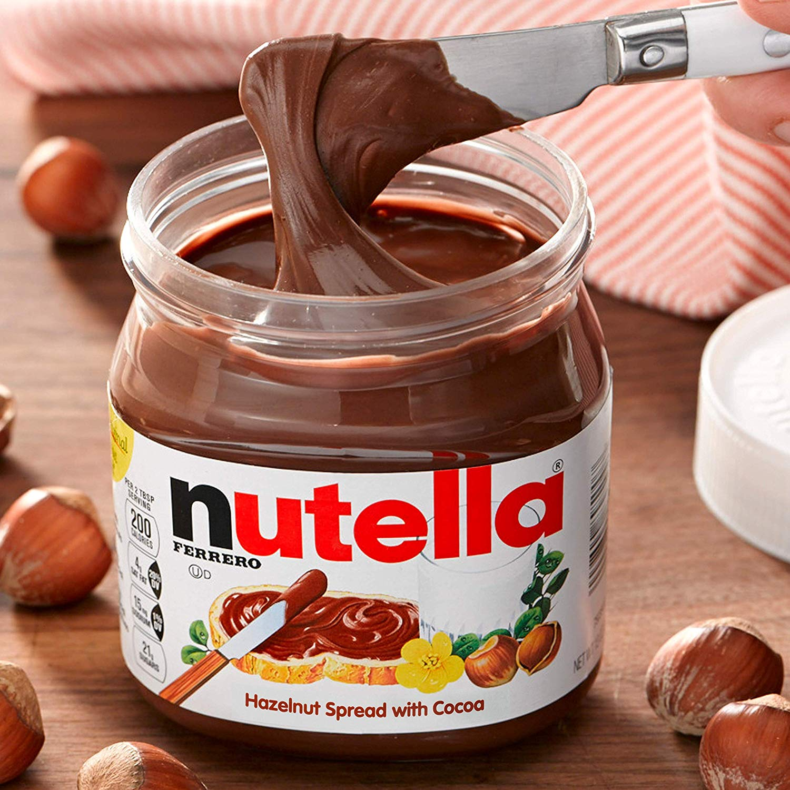

# 제목

.footer: [default theme](.) | [abyss theme](abyss.html) | [void theme](void.html) | [white theme](white.html)

---

# 단락

<!--
.notes: notes
-->

이탈리아 알바에 본사를 둔 페레로 社가 만들고 있는 헤이즐넛 스프레드. 100g당 545kcal의 고열량이므로 다이어트를 해야 하는 사람들은 반드시 피해야 할 칼로리 폭탄이다. 금박지로 포장된 동그란 초콜릿인 페레로 로쉐에 들어있는 초콜릿 잼이 바로 누텔라이다.

<!--
.notes: more notes
-->

Nutella is a brand of sweetened hazelnut cocoa spread. Nutella is manufactured by the Italian company Ferrero and was first introduced in 1964, although its first iteration dates to 1963.

---

# 키워드

- 악마의똥
- 하나님
- 한번만

---

# 이미지

<!---->

